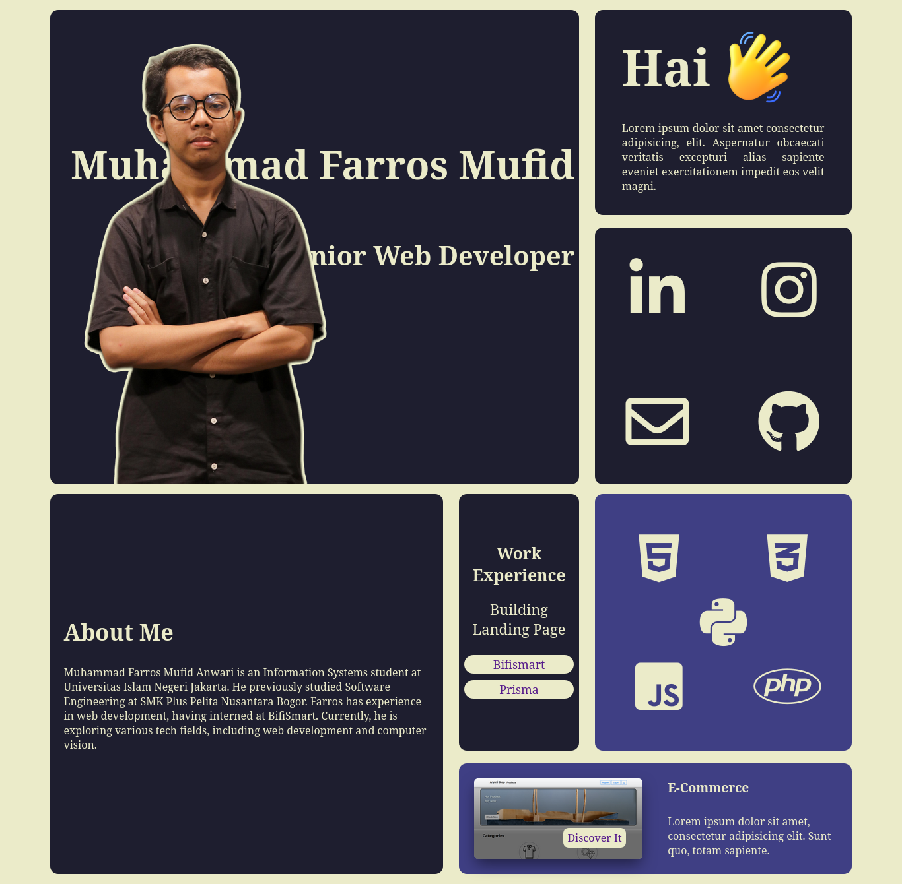

# Web Development Final Project - GDGOC UIN Jakarta

This repository contains the final project for the Web Development Front-End course at GDGOC UIN Jakarta. The project is a portfolio website built using only HTML and CSS, without JavaScript.

# Project Overview

The project consists of a personal portfolio website showcasing various works and achievements. The structure and styling have been implemented in separate commits to track progress efficiently.

**Commit History**

Initial Commit: Added the basic structure with HTML and assets (images, icons, fonts, etc.).

CSS Integration & Portfolio Completion: Applied vanilla CSS for styling and finalized the portfolio section.

# Features

Fully responsive design

Clean and minimalistic layout

Well-structured HTML and CSS code

No dependencies on JavaScript or external frameworks

# How to Use

Clone this repository:

    git clone https://github.com/Lordsans-404/My-Portfolio.git

Open the index.html file in your browser to view the website.

Developed with dedication by the Staff of Web Development Front-End at GDGOC UIN Jakarta.

